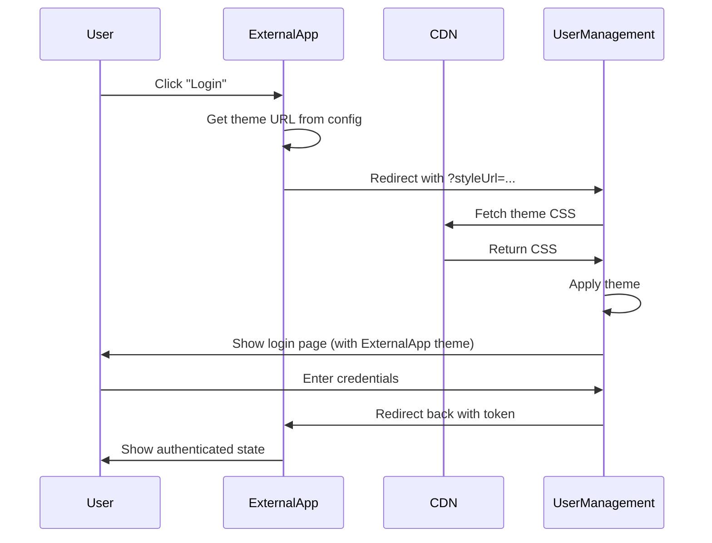

# ExternalApp → UserManagement Theme Integration

## Overview

This guide shows how to pass ExternalApp's theme to UserManagement WebUI for consistent branding across applications.

---

## 🎯 Use Case

When a user navigates from ExternalApp to UserManagement (for authentication or user profile management), you want to maintain the same visual theme and branding.

---

## 🔧 Implementation

### Option 1: Direct URL Parameter

#### From ExternalApp to UserManagement

```typescript
// In ExternalApp - Angular component or service
export class AuthService {
  private userManagementUrl = 'http://localhost:4201'; // Or production URL
  private themeUrl = 'https://cdn.yourcompany.com/external-app-theme.css';
  
  redirectToLogin(): void {
    const loginUrl = `${this.userManagementUrl}/login`;
    const params = new URLSearchParams({
      styleUrl: this.themeUrl,
      redirect: window.location.href // Return URL after login
    });
    
    window.location.href = `${loginUrl}?${params.toString()}`;
  }
  
  redirectToProfile(): void {
    const profileUrl = `${this.userManagementUrl}/profile`;
    const params = new URLSearchParams({
      styleUrl: this.themeUrl
    });
    
    window.location.href = `${profileUrl}?${params.toString()}`;
  }
}
```

### Option 2: OAuth/OIDC Flow with Theme

```typescript
// ExternalApp - OAuth redirect with theme
export class OAuthService {
  private authUrl = 'http://localhost:4201/authorize';
  private themeUrl = 'https://cdn.yourcompany.com/external-app-theme.css';
  
  initiateOAuthFlow(): void {
    const params = new URLSearchParams({
      client_id: 'your-client-id',
      redirect_uri: 'http://localhost:4203/callback',
      response_type: 'code',
      scope: 'openid profile email',
      state: this.generateState(),
      styleUrl: this.themeUrl // Theme parameter
    });
    
    window.location.href = `${this.authUrl}?${params.toString()}`;
  }
}
```

### Option 3: Iframe Integration with Theme

```typescript
// ExternalApp - Embed UserManagement in iframe with theme
@Component({
  selector: 'app-user-profile-embed',
  template: `
    <iframe 
      [src]="profileUrl" 
      frameborder="0" 
      width="100%" 
      height="600px">
    </iframe>
  `
})
export class UserProfileEmbedComponent implements OnInit {
  profileUrl!: SafeResourceUrl;
  
  constructor(
    private sanitizer: DomSanitizer,
    private themeService: ThemeService
  ) {}
  
  ngOnInit(): void {
    const baseUrl = 'http://localhost:4201/profile';
    const themeUrl = this.themeService.getCurrentThemeUrl();
    const url = `${baseUrl}?styleUrl=${encodeURIComponent(themeUrl)}`;
    
    this.profileUrl = this.sanitizer.bypassSecurityTrustResourceUrl(url);
  }
}
```

---

## 📁 Theme File Structure

### Create Your ExternalApp Theme CSS

```bash
# ExternalApp theme file location
/ExternalApp/WebUI/external-app/src/assets/themes/external-theme.css
```

```css
/* external-theme.css */
:root {
  /* Your ExternalApp brand colors */
  --color-primary: rgb(168 85 247);        /* Purple-400 - Your brand */
  --color-primary-hover: rgb(147 51 234);  /* Purple-600 */
  --color-primary-text: rgb(255 255 255);
  
  --color-secondary: rgb(59 130 246);      /* Blue-500 */
  --color-secondary-hover: rgb(37 99 235);
  
  --color-header-bg: rgb(168 85 247);      /* Match primary */
  
  --color-background: rgb(250 245 255);    /* Purple-50 */
  --color-surface: rgb(255 255 255);
  --color-surface-hover: rgb(245 243 255);
  
  --color-text: rgb(59 7 100);             /* Purple-950 */
  --color-text-secondary: rgb(107 33 168); /* Purple-800 */
  --color-text-muted: rgb(147 51 234);
  
  --color-border: rgb(233 213 255);        /* Purple-200 */
  --color-border-focus: rgb(168 85 247);
  
  --color-success: rgb(34 197 94);
  --color-warning: rgb(251 191 36);
  --color-error: rgb(239 68 68);
  
  --color-input-bg: rgb(255 255 255);
  --color-modal-overlay: rgba(168, 85, 247, 0.4);
}

/* Dark mode support */
:root.dark {
  --color-primary: rgb(192 132 252);       /* Purple-300 */
  --color-primary-hover: rgb(168 85 247);
  
  --color-background: rgb(17 24 39);       /* Gray-900 */
  --color-surface: rgb(31 41 55);          /* Gray-800 */
  --color-surface-hover: rgb(55 65 81);
  
  --color-text: rgb(243 232 255);          /* Purple-100 */
  --color-text-secondary: rgb(216 180 254);
  --color-text-muted: rgb(192 132 252);
  
  --color-border: rgb(88 28 135);          /* Purple-900 */
  --color-modal-overlay: rgba(0, 0, 0, 0.8);
}
```

---

## 🚀 Deployment Steps

### Step 1: Host Your Theme CSS

#### Option A: Host with ExternalApp (Development)

```bash
# Access via ExternalApp's dev server
http://localhost:4203/assets/themes/external-theme.css
```

#### Option B: Host on CDN (Production)

```bash
# Upload to S3/CDN
aws s3 cp external-theme.css s3://your-bucket/themes/
aws s3api put-object-acl --bucket your-bucket --key themes/external-theme.css --acl public-read

# Access via CDN
https://cdn.yourcompany.com/themes/external-theme.css
```

### Step 2: Update ExternalApp Configuration

```typescript
// ExternalApp - environment.ts
export const environment = {
  production: false,
  userManagementUrl: 'http://localhost:4201',
  themeUrl: 'http://localhost:4203/assets/themes/external-theme.css'
};

// environment.prod.ts
export const environment = {
  production: true,
  userManagementUrl: 'https://auth.yourcompany.com',
  themeUrl: 'https://cdn.yourcompany.com/themes/external-theme.css'
};
```

### Step 3: Create Integration Service

```typescript
// ExternalApp - services/user-management-integration.service.ts
import { Injectable } from '@angular/core';
import { environment } from '../../environments/environment';

@Injectable({
  providedIn: 'root'
})
export class UserManagementIntegrationService {
  private userMgmtBaseUrl = environment.userManagementUrl;
  private themeUrl = environment.themeUrl;

  /**
   * Redirect to UserManagement login with ExternalApp theme
   */
  loginWithTheme(returnUrl?: string): void {
    const params = new URLSearchParams({
      styleUrl: this.themeUrl,
      ...(returnUrl && { redirect: returnUrl })
    });
    
    window.location.href = `${this.userMgmtBaseUrl}/login?${params}`;
  }

  /**
   * Redirect to UserManagement profile with ExternalApp theme
   */
  openProfile(userId?: string): void {
    const profilePath = userId ? `/profile/${userId}` : '/profile';
    const params = new URLSearchParams({
      styleUrl: this.themeUrl
    });
    
    window.location.href = `${this.userMgmtBaseUrl}${profilePath}?${params}`;
  }

  /**
   * Get UserManagement URL with theme parameter
   */
  getThemedUrl(path: string, additionalParams?: Record<string, string>): string {
    const params = new URLSearchParams({
      styleUrl: this.themeUrl,
      ...additionalParams
    });
    
    return `${this.userMgmtBaseUrl}${path}?${params}`;
  }

  /**
   * Open UserManagement in new window with theme
   */
  openInNewWindow(path: string, additionalParams?: Record<string, string>): void {
    const url = this.getThemedUrl(path, additionalParams);
    window.open(url, '_blank');
  }
}
```

---

## 🎯 Usage Examples

### Example 1: Login Button

```typescript
// ExternalApp component
@Component({
  selector: 'app-header',
  template: `
    <button (click)="login()" class="btn-primary">
      Login
    </button>
  `
})
export class HeaderComponent {
  constructor(
    private userMgmtService: UserManagementIntegrationService
  ) {}
  
  login(): void {
    // Redirects to UserManagement login with ExternalApp theme
    this.userMgmtService.loginWithTheme(window.location.href);
  }
}
```

### Example 2: Profile Link

```typescript
// ExternalApp component
@Component({
  selector: 'app-user-menu',
  template: `
    <div class="user-menu">
      <button (click)="openProfile()">
        My Profile
      </button>
    </div>
  `
})
export class UserMenuComponent {
  constructor(
    private userMgmtService: UserManagementIntegrationService
  ) {}
  
  openProfile(): void {
    // Opens UserManagement profile with ExternalApp theme
    this.userMgmtService.openProfile();
  }
}
```

### Example 3: Settings Link

```typescript
// ExternalApp component
@Component({
  selector: 'app-settings',
  template: `
    <a [href]="settingsUrl" target="_blank">
      Account Settings
    </a>
  `
})
export class SettingsComponent implements OnInit {
  settingsUrl!: string;
  
  constructor(
    private userMgmtService: UserManagementIntegrationService
  ) {}
  
  ngOnInit(): void {
    this.settingsUrl = this.userMgmtService.getThemedUrl('/settings');
  }
}
```

---

## 🔄 Complete Integration Flow



---

## 📋 Testing Checklist

### Local Testing

```bash
# 1. Start ExternalApp
cd ExternalApp/WebUI/external-app
npx ng serve --port 4203

# 2. Start UserManagement
cd UserManagement/WebUI/user-management-app  
npx ng serve --port 4201

# 3. Test theme passing
# Click login button in ExternalApp
# Should redirect to: http://localhost:4201/login?styleUrl=http://localhost:4203/assets/themes/external-theme.css

# 4. Verify theme applied
# Open browser DevTools
# Check <head> for: <link id="external-theme-stylesheet" href="...">
# Check CSS variables in Computed styles
```

### Production Testing

```bash
# 1. Deploy theme CSS to CDN
https://cdn.yourcompany.com/themes/external-theme.css

# 2. Update environment.prod.ts with CDN URL

# 3. Test integration
https://app.yourcompany.com/login
# Should redirect to: https://auth.yourcompany.com/login?styleUrl=https://cdn.yourcompany.com/themes/external-theme.css
```

---

## 🔒 Security Considerations

### 1. CORS Configuration

Ensure UserManagement allows loading CSS from ExternalApp's domain:

```typescript
// UserManagement - main.ts or security config
// Allow CDN domain for CSS loading
const allowedCssDomains = [
  'https://cdn.yourcompany.com',
  'http://localhost:4203' // For development
];
```

### 2. Theme URL Whitelist (Optional)

For added security, whitelist allowed theme URLs in UserManagement:

```typescript
// UserManagement - theme.service.ts
private readonly ALLOWED_THEME_DOMAINS = [
  'cdn.yourcompany.com',
  'localhost:4203'
];

private isValidUrl(url: string): boolean {
  try {
    const urlObj = new URL(url);
    if (urlObj.protocol !== 'http:' && urlObj.protocol !== 'https:') {
      return false;
    }
    // Check against whitelist
    return this.ALLOWED_THEME_DOMAINS.some(domain => 
      urlObj.hostname === domain || urlObj.host === domain
    );
  } catch {
    return false;
  }
}
```

---

## 🎨 Advanced: Dynamic Theme Selection

Allow users to choose themes in ExternalApp:

```typescript
// ExternalApp - theme-selector.component.ts
@Component({
  selector: 'app-theme-selector',
  template: `
    <select (change)="onThemeChange($event)">
      <option value="default">Default Theme</option>
      <option value="dark">Dark Theme</option>
      <option value="high-contrast">High Contrast</option>
    </select>
  `
})
export class ThemeSelectorComponent {
  private themes = {
    default: 'https://cdn.yourcompany.com/themes/default.css',
    dark: 'https://cdn.yourcompany.com/themes/dark.css',
    'high-contrast': 'https://cdn.yourcompany.com/themes/high-contrast.css'
  };
  
  constructor(
    private userMgmtService: UserManagementIntegrationService
  ) {}
  
  onThemeChange(event: Event): void {
    const theme = (event.target as HTMLSelectElement).value;
    const themeUrl = this.themes[theme as keyof typeof this.themes];
    
    // Save preference
    localStorage.setItem('selected-theme-url', themeUrl);
    
    // Apply to current app
    // ... apply theme logic ...
  }
  
  redirectToUserManagement(path: string): void {
    const savedTheme = localStorage.getItem('selected-theme-url');
    const url = this.userMgmtService.getThemedUrl(path, {
      styleUrl: savedTheme || this.themes.default
    });
    window.location.href = url;
  }
}
```

---

## 📊 Monitoring & Analytics

Track theme usage across applications:

```typescript
// ExternalApp - analytics.service.ts
export class AnalyticsService {
  trackThemeRedirect(destination: string, themeUrl: string): void {
    // Log to analytics
    console.log('Theme redirect:', {
      destination,
      themeUrl,
      timestamp: new Date().toISOString(),
      userAgent: navigator.userAgent
    });
    
    // Send to analytics service
    // analytics.track('theme_redirect', { ... });
  }
}

// Usage in integration service
loginWithTheme(returnUrl?: string): void {
  this.analyticsService.trackThemeRedirect('login', this.themeUrl);
  // ... redirect logic ...
}
```

---

## ✨ Summary

**Yes!** ExternalApp's theme CSS can be passed to UserManagement WebUI via URL parameter:

✅ **Simple Integration**: Just add `?styleUrl=...` parameter  
✅ **Maintains Branding**: Same look across both apps  
✅ **Flexible**: Works with redirects, OAuth, iframes  
✅ **Secure**: URL validation and CORS protection  
✅ **Persistent**: Theme URL saved to localStorage  

**Example Flow:**
```
ExternalApp → redirects to → UserManagement?styleUrl=https://cdn.example.com/theme.css
```

Both apps will now share the same visual theme! 🎨
