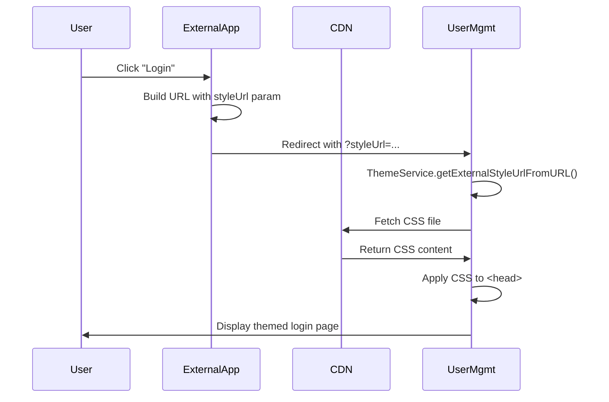

# External Theme Integration Guide

## Overview

The UserManagement application now supports **dynamic external stylesheet loading** via URL parameters. This allows external applications to apply custom themes by hosting their own CSS files and passing the URL to the application.

## 🎨 How It Works

### URL Parameters

You can load external CSS by adding one of these query parameters to any URL:

- `?styleUrl=https://your-cdn.com/theme.css`
- `?themeUrl=https://your-cdn.com/theme.css`
- `?cssUrl=https://your-cdn.com/theme.css`

### Loading Priority

The theme system follows this priority order:

1. **External Style URL** (from URL parameter) - **Highest Priority**
2. **Theme Name** (from URL parameter like `?theme=dark`)
3. **Saved Custom Theme URL** (from previous session)
4. **Saved Theme Preference** (from localStorage)
5. **Default Light Theme** - **Lowest Priority**

## 📋 Usage Examples

### Basic Usage

```
# Load a custom corporate theme
https://your-app.com/?styleUrl=https://cdn.example.com/corporate-theme.css

# Load from your own CDN
https://your-app.com/login?themeUrl=https://yourcdn.com/brand-colors.css

# Load for specific sections
https://your-app.com/dashboard?cssUrl=https://static.example.com/dashboard-theme.css
```

### Combining with Other Parameters

```
# External theme with redirect
https://your-app.com/login?styleUrl=https://cdn.example.com/theme.css&redirect=/dashboard

# External theme with user context
https://your-app.com/?styleUrl=https://cdn.example.com/theme.css&userId=12345
```

### From External Applications

**HTML Link:**
```html
<a href="https://auth.yourcompany.com/?styleUrl=https://cdn.yourcompany.com/company-theme.css">
  Login to Portal
</a>
```

**JavaScript Redirect:**
```javascript
const themeUrl = 'https://cdn.yourcompany.com/company-theme.css';
const authUrl = `https://auth.yourcompany.com/login?styleUrl=${encodeURIComponent(themeUrl)}`;
window.location.href = authUrl;
```

**OAuth/OIDC Flow:**
```javascript
const authParams = new URLSearchParams({
  client_id: 'your-client-id',
  redirect_uri: 'https://your-app.com/callback',
  response_type: 'code',
  styleUrl: 'https://cdn.yourcompany.com/theme.css'
});

window.location.href = `https://auth.yourcompany.com/authorize?${authParams}`;
```

## 🎨 Creating Your Custom Theme CSS

### Template Structure

Use the CSS custom properties pattern to override default theme colors:

```css
:root {
  /* Primary Brand Colors */
  --color-primary: rgb(YOUR_R YOUR_G YOUR_B);
  --color-primary-hover: rgb(YOUR_R YOUR_G YOUR_B);
  --color-primary-text: rgb(255 255 255);
  
  /* Background Colors */
  --color-background: rgb(YOUR_R YOUR_G YOUR_B);
  --color-surface: rgb(YOUR_R YOUR_G YOUR_B);
  
  /* Text Colors */
  --color-text: rgb(YOUR_R YOUR_G YOUR_B);
  --color-text-secondary: rgb(YOUR_R YOUR_G YOUR_B);
  
  /* Border Colors */
  --color-border: rgb(YOUR_R YOUR_G YOUR_B);
  --color-border-focus: rgb(YOUR_R YOUR_G YOUR_B);
  
  /* Status Colors */
  --color-success: rgb(YOUR_R YOUR_G YOUR_B);
  --color-warning: rgb(YOUR_R YOUR_G YOUR_B);
  --color-error: rgb(YOUR_R YOUR_G YOUR_B);
}
```

### Complete Variable List

See `EXTERNAL_THEME_EXAMPLE.css` for a complete working example with all available CSS custom properties.

**Available CSS Custom Properties:**

| Property | Description | Example |
|----------|-------------|---------|
| `--color-primary` | Primary brand color | `rgb(37 99 235)` |
| `--color-primary-hover` | Primary hover state | `rgb(29 78 216)` |
| `--color-primary-text` | Text on primary color | `rgb(255 255 255)` |
| `--color-secondary` | Secondary accent color | `rgb(107 114 128)` |
| `--color-secondary-hover` | Secondary hover state | `rgb(75 85 99)` |
| `--color-header-bg` | Header background | `rgb(37 99 235)` |
| `--color-background` | Page background | `rgb(244 247 246)` |
| `--color-surface` | Card/panel backgrounds | `rgb(255 255 255)` |
| `--color-surface-hover` | Surface hover state | `rgb(249 250 251)` |
| `--color-text` | Primary text color | `rgb(51 51 51)` |
| `--color-text-secondary` | Secondary text color | `rgb(107 114 128)` |
| `--color-text-muted` | Muted text color | `rgb(156 163 175)` |
| `--color-border` | Border color | `rgb(209 213 219)` |
| `--color-border-focus` | Focus state border | `rgb(37 99 235)` |
| `--color-success` | Success messages | `rgb(5 150 105)` |
| `--color-warning` | Warning messages | `rgb(217 119 6)` |
| `--color-error` | Error messages | `rgb(220 38 38)` |
| `--color-input-bg` | Input backgrounds | `rgb(255 255 255)` |
| `--color-modal-overlay` | Modal overlay | `rgba(107, 114, 128, 0.5)` |

### Optional: Dark Mode Support

Your external CSS can also define dark mode variants:

```css
:root.dark {
  --color-primary: rgb(59 130 246);
  --color-background: rgb(15 23 42);
  --color-text: rgb(241 245 249);
  /* ... other dark mode colors ... */
}
```

When users switch to dark mode (via the UI or `?theme=dark` parameter), your custom colors will be applied if you've defined the `:root.dark` selector.

## 🔒 Security Considerations

### URL Validation

The theme service validates URLs before loading:

- ✅ Only `http://` and `https://` protocols are allowed
- ✅ URL must be well-formed
- ❌ JavaScript protocols (`javascript:`, `data:`) are blocked
- ❌ File protocols (`file://`) are blocked

### Recommended Security Practices

1. **Host CSS on Trusted CDN**: Use your own CDN or a trusted third-party CDN
2. **Use HTTPS**: Always serve CSS over HTTPS to prevent MITM attacks
3. **Implement CSP**: Configure Content Security Policy headers on your server
4. **Whitelist Domains** (Optional): For production, consider implementing a domain whitelist in the `isValidUrl()` method

### Example: Adding Domain Whitelist

```typescript
// In theme.service.ts
private readonly ALLOWED_DOMAINS = [
  'cdn.yourcompany.com',
  'static.yourcompany.com',
  'assets.example.com'
];

private isValidUrl(url: string): boolean {
  try {
    const urlObj = new URL(url);
    if (urlObj.protocol !== 'http:' && urlObj.protocol !== 'https:') {
      return false;
    }
    // Check against whitelist
    return this.ALLOWED_DOMAINS.some(domain => urlObj.hostname === domain);
  } catch {
    return false;
  }
}
```

## 🚀 Deployment Guide

### Step 1: Create Your Theme CSS

1. Copy `EXTERNAL_THEME_EXAMPLE.css` as a template
2. Customize the CSS custom properties with your brand colors
3. Test locally by serving the file

### Step 2: Host the CSS File

**Option A: Use Your Own CDN**
```bash
# Upload to your CDN
aws s3 cp custom-theme.css s3://your-bucket/themes/
# Make it publicly accessible
aws s3api put-object-acl --bucket your-bucket --key themes/custom-theme.css --acl public-read
```

**Option B: Use GitHub Pages**
```bash
# Create a public repo
mkdir theme-hosting
cd theme-hosting
cp custom-theme.css .
git init
git add .
git commit -m "Add custom theme"
git push origin main
# Enable GitHub Pages in repo settings
# Your CSS will be at: https://yourusername.github.io/theme-hosting/custom-theme.css
```

**Option C: Use a Public CDN Service**
- jsDelivr: https://www.jsdelivr.com/
- Cloudflare Pages
- Netlify
- Vercel

### Step 3: Test the Integration

```bash
# Test with your hosted CSS
http://localhost:4201/?styleUrl=https://your-cdn.com/custom-theme.css
```

### Step 4: Update External Applications

Update your external applications to pass the `styleUrl` parameter:

```javascript
// In your external app
const userManagementUrl = 'https://auth.yourcompany.com';
const themeUrl = 'https://cdn.yourcompany.com/corporate-theme.css';

// For login redirect
window.location.href = `${userManagementUrl}/login?styleUrl=${encodeURIComponent(themeUrl)}`;
```

## 📊 Monitoring & Debugging

### Browser Console Logging

The theme service logs important events:

```
✅ "External stylesheet loaded successfully: https://..."
❌ "Failed to load external stylesheet: https://..."
❌ "Invalid stylesheet URL: ..."
```

### Checking Applied Theme

**Browser DevTools:**
1. Open DevTools (F12)
2. Go to Elements tab
3. Check `<head>` for `<link id="external-theme-stylesheet">`
4. Check `<html>` element for theme classes (`dark`, `high-contrast`)
5. Check Computed styles for CSS custom properties

**JavaScript Console:**
```javascript
// Check current theme
const themeService = document.querySelector('app-root')?.__ngContext__?.[8]?.themeService;
console.log('Current theme:', themeService?.getCurrentTheme());

// Check CSS variables
const root = document.documentElement;
const primaryColor = getComputedStyle(root).getPropertyValue('--color-primary');
console.log('Primary color:', primaryColor);
```

### Common Issues

**Issue**: CSS not loading
- ✅ Check browser console for CORS errors
- ✅ Verify CSS URL is accessible (try opening in new tab)
- ✅ Check that CDN allows cross-origin requests
- ✅ Verify URL uses `https://`

**Issue**: Colors not changing
- ✅ Verify CSS custom properties are defined in `:root` selector
- ✅ Check that property names match exactly (case-sensitive)
- ✅ Use RGB format: `rgb(R G B)` not `#RRGGBB`

**Issue**: Theme not persisting
- ✅ Check browser allows localStorage
- ✅ Check for browser extensions blocking storage

## 🎯 Best Practices

### 1. CSS Organization

```css
/* ✅ GOOD: Organized by section with comments */
:root {
  /* Brand Colors */
  --color-primary: rgb(37 99 235);
  --color-secondary: rgb(107 114 128);
  
  /* Layout Colors */
  --color-background: rgb(244 247 246);
  --color-surface: rgb(255 255 255);
  
  /* Text Colors */
  --color-text: rgb(51 51 51);
}

/* ❌ AVOID: Random order, no organization */
:root {
  --color-border: rgb(209 213 219);
  --color-primary: rgb(37 99 235);
  --color-text-muted: rgb(156 163 175);
}
```

### 2. Color Format

```css
/* ✅ GOOD: Use RGB format for Tailwind compatibility */
--color-primary: rgb(37 99 235);

/* ❌ AVOID: Hex or named colors won't work with Tailwind utilities */
--color-primary: #2563eb;
--color-primary: blue;
```

### 3. Testing Workflow

1. Test locally first
2. Test with dark mode toggle
3. Test responsiveness (mobile, tablet, desktop)
4. Test in multiple browsers (Chrome, Firefox, Safari)
5. Test accessibility (contrast ratios, screen readers)

### 4. Version Control

Add versioning to your theme URLs:
```
https://cdn.yourcompany.com/themes/v1.2.0/corporate-theme.css
```

This allows you to:
- Update themes without breaking existing integrations
- Rollback if issues occur
- A/B test different theme versions

## 📱 Example: Complete Integration Flow



## 🔄 Programmatic Theme Loading

You can also load external themes programmatically from within the application:

```typescript
import { Component } from '@angular/core';
import { ThemeService } from './services/theme.service';

@Component({
  selector: 'app-theme-manager',
  template: `
    <button (click)="loadCorporateTheme()">
      Load Corporate Theme
    </button>
  `
})
export class ThemeManagerComponent {
  constructor(private themeService: ThemeService) {}
  
  loadCorporateTheme(): void {
    const cssUrl = 'https://cdn.yourcompany.com/corporate-theme.css';
    this.themeService.setCustomThemeUrl(cssUrl);
  }
}
```

## 📚 Additional Resources

- **Example CSS**: See `EXTERNAL_THEME_EXAMPLE.css`
- **Integration Patterns**: See `THEME_INTEGRATION_GUIDE.md`
- **Migration Guide**: See `THEME_MIGRATION_SUMMARY.md`
- **Tailwind Documentation**: https://tailwindcss.com/docs/customizing-colors

## 🆘 Support

For issues or questions:
1. Check browser console for error messages
2. Verify CSS URL is accessible
3. Test with the example CSS file first
4. Review this documentation
5. Contact your development team
